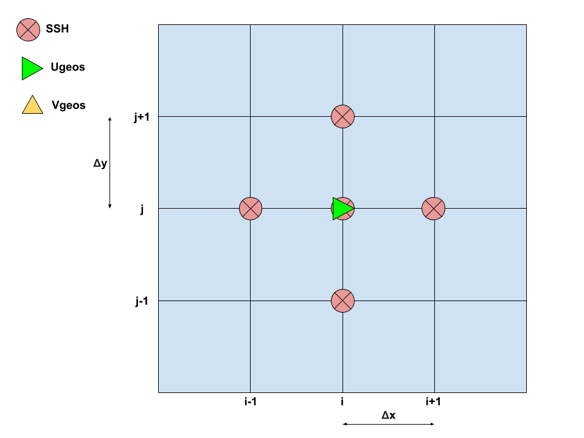
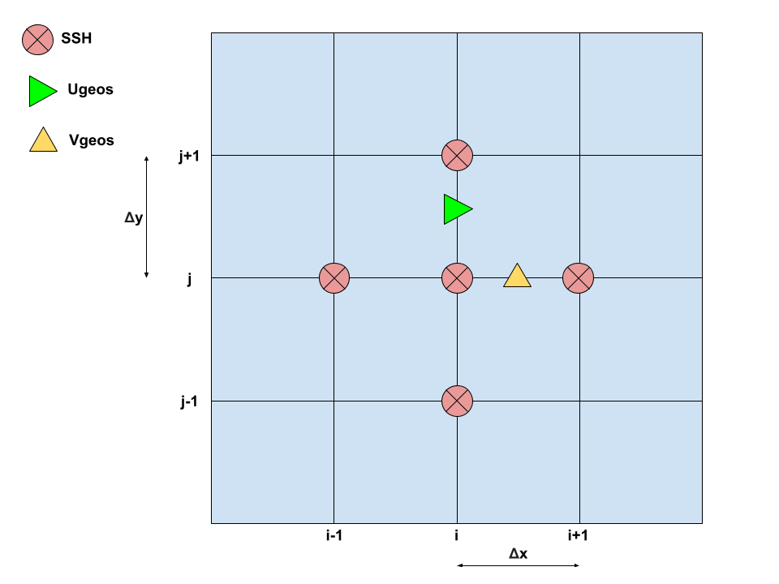

# Context

The zonal $U_{g}$ and meridional $V_{g}$ component of the geostrophic current $\mathbf{U}$ can be derived from the sea surface fields from the following well known formutation (geostrophic approaximation): 

 $U_{g}$ = - $\frac{g}{f} \frac{\partial SSH}{\partial y}$ = - $\alpha \frac{\partial SSH}{\partial y}$ 
 
 $V_{g}$ = $\frac{g}{f} \frac{\partial SSH}{\partial x}$ = $\alpha \frac{\partial SSH}{\partial x}$ 
 
 The divergence of this velocity is by construction non-divergent:
 
 $\mathbf{\nabla} \cdot \mathbf{U} $ = $\frac{\partial U_{g}}{\partial x}$ + $\frac{\partial V_{g}}{\partial y}$ = - $\alpha \frac{\partial^2 SSH}{\partial x \partial y}$ + $\alpha \frac{\partial^2 SSH}{\partial x \partial y}$  = __0__
 
 
In gridded datasets like altimetry products produced through numerical simulation or interpolation techniques, partial derivatives can be computed using finite differences. 

However, various formulations exist for numerically differentiating gridded fields (see for example [1]).
 
# Centered and uncentered (forward/backward) finite difference
 
### Central finite difference
 $\frac{\partial SSH}{\partial x}$ $\approx$ $\frac{SSH(i+1, j) - SSH(i-1, j)}{2 \Delta x}$  
 
 $\frac{\partial SSH}{\partial y}$ $\approx$ $\frac{SSH(i, j+1) - SSH(i, j-1)}{2 \Delta y}$  
 
 $\frac{\partial U_{g}}{\partial x}$ $\approx$ $\frac{U_{g}(i+1, j) - U_{g}(i-1, j)}{2 \Delta x}$ = $\alpha \frac{(\textcolor{red}{-SSH(i+1, j+1)} \textcolor{green}{+ SSH(i+1, j-1)} + (SSH(i-1, j+1) \textcolor{blue}{- SSH(i-1, j-1)}) )}{4 \Delta x \Delta y}$
 
 $\frac{\partial V_{g}}{\partial y}$ $\approx$ $\frac{V_{g}(i, j+1) - V_{g}(i, j-1)}{2 \Delta y}$ = $\alpha \frac{(\textcolor{red}{SSH(i+1, j+1)} - SSH(i-1, j+1) \textcolor{green}{- SSH(i+1, j-1)} + \textcolor{blue}{SSH(i-1, j-1)})}{4 \Delta x \Delta y}$
 
 So here $\mathbf{\nabla} \cdot \mathbf{U} $ = __0__
 
 
 ### Forward finite difference
 $\frac{\partial SSH}{\partial x}$ $\approx$ $\frac{SSH(i+1, j) - SSH(i, j)}{\Delta x}$  
 
 $\frac{\partial SSH}{\partial y}$ $\approx$ $\frac{SSH(i, j+1) - SSH(i, j)}{\Delta y}$  
 
 $\frac{\partial U_{g}}{\partial x}$ $\approx$ $\frac{U_{g}(i+1, j) - U_{g}(i, j)}{\Delta x}$ = $\alpha \frac{(\textcolor{red}{-SSH(i+1, j+1)} \textcolor{green}{+ SSH(i+1, j)} + (SSH(i, j+1) \textcolor{blue}{ - SSH(i, j)}) )}{\Delta x \Delta y}$ 
 
 $\frac{\partial V_{g}}{\partial y}$ $\approx$ $\frac{V_{g}(i, j+1) - V_{g}(i, j)}{\Delta y}$ = $\alpha \frac{(\textcolor{red}{SSH(i+1, j+1)} - SSH(i, j+1) \textcolor{green}{- SSH(i+1, j)} + \textcolor{blue}{SSH(i, j)})}{\Delta x \Delta y}$
 
So here $\mathbf{\nabla} \cdot \mathbf{U} $ = __0__

### What occurs if the method of differentiation used for the divergence operator does not align with the differentiation approach employed in computing the geostrophic currents?

Let say that geostrophic current are derived from __centered__ differenciation:

$\frac{\partial SSH}{\partial x}$ $\approx$ $\frac{SSH(i+1, j) - SSH(i-1, j)}{2 \Delta x}$  
 
 $\frac{\partial SSH}{\partial y}$ $\approx$ $\frac{SSH(i, j+1) - SSH(i, j-1)}{2 \Delta y}$ 
 
 and that the divergence is computed from __uncentered__ differenciation:
 
 $\frac{\partial U_{g}}{\partial x}$ $\approx$ $\frac{U_{g}(i+1, j) - U_{g}(i, j)}{\Delta x}$ = $\alpha \frac{(\textcolor{red}{-SSH(i+1, j+1)} + SSH(i+1, j-1) + SSH(i, j+1) - SSH(i, j-1))}{2 \Delta x \Delta y}$
 
 $\frac{\partial V_{g}}{\partial y}$ $\approx$ $\frac{V_{g}(i, j+1) - V_{g}(i, j)}{\Delta y}$ = $\alpha \frac{(\textcolor{red}{SSH(i+1, j+1)} - SSH(i-1, j+1) - SSH(i+1, j) + SSH(i-1, j))}{2 \Delta x \Delta y}$
 
So here $\mathbf{\nabla} \cdot \mathbf{U} $  $\neq$ __0__

<h3>When the differentiation method applied to the divergence operator is not consistent with the differentiation technique used to calculate geostrophic currents, it results in divergence in the geostrophic velocity field's </h3> 

 
### Impact for application on altimetry gridded fields

So, the main point here is that it appears crucial if one desires a divergence-free geostrophic flow that the differentiation scheme remains consistent between the computed velocity field in the altimetry product and within the divergence operator.

An alternative for altimetry users seeking a divergence-free geostrophic flow is to avoid using the velocity fields provided in the product and instead compute their own geostrophic currents from the sea surface height (SSH) fields within the product using the same differentiation operator as in their tools.

It is important to mention that for the DUACS gridded product the anomaly of the geostrophic current disseminated to users is derived from gridded SLA field. It is computed using a 9-point stencil width methodology (Arbic et al., 2012). The absolute geostrophic current is obtained by adding to this anomaly the mean geostrophic current associated with the MDT field (MDT CNES CLS 18). Consequenly, a 9-point stencil width methodology should be implemented for the compuation of the divergence.

### A view on the position of the velocity point
The method of discretization also may determine the position of U, V component
- ### Central finite difference

- ### Forward finite difference

### Some references

[1] Higer order and accuracy finite difference: https://en.wikipedia.org/wiki/Finite_difference_coefficient

[2] Arbic, B. K., Scott, R. B., Chelton, D. B., Richman, J. G., and Shriver, J. F.: Effects of stencil width on surface ocean geostrophic velocity and vorticity estimation from gridded satellite altimeter data: OCEAN GEOSTROPHIC VELOCITY ESTIMATION, J. Geophys. Res. Oceans, 117, n/a-n/a, https://doi.org/10.1029/2011JC007367, 2012.

 